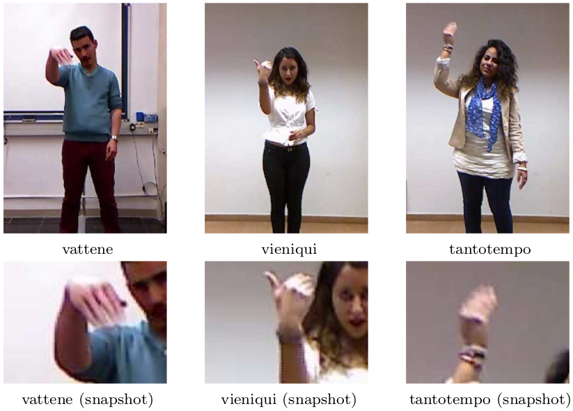
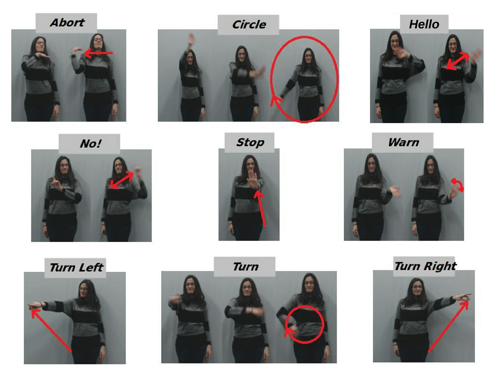
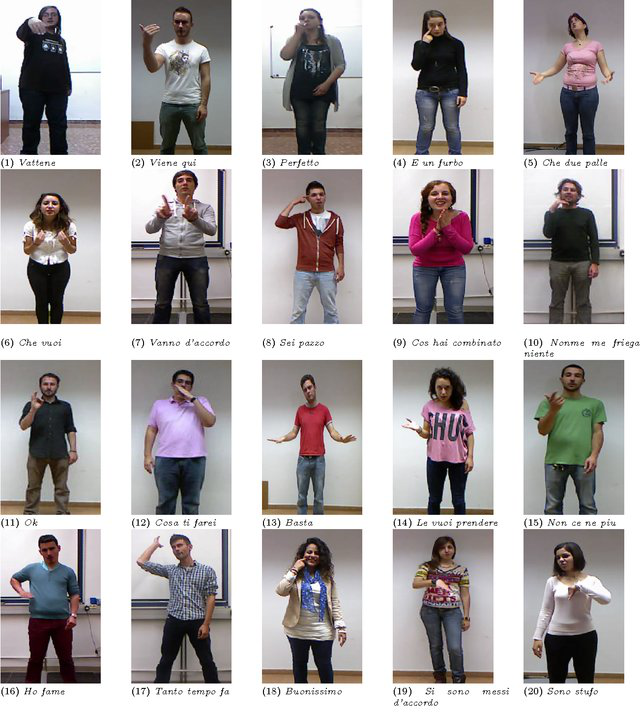

# Snapture - A Novel Neural Architecture for Combined Static and Dynamic Hand Gesture Recognition
This repository contains the source code used for developing the experiments of the paper titled: 
[Snapture - A Novel Neural Architecture for Combined Static and Dynamic Hand Gesture Recognition](https://link.springer.com/article/10.1007/s12559-023-10174-z) (Open access) by Hassan Ali, Doreen Jirak and Stefan Wermter. The study was conducted in the Knowledge Technology (WTM) group at the University of Hamburg.

<p align="center">
	
</p>

## Datasets
### GRIT Robot Commands Dataset
This dataset was recorded at the Knowledge Technology (WTM) group at the University of Hamburg and can be requested [here](https://www.inf.uni-hamburg.de/en/inst/ab/wtm/research/corpora.html).

<p align="center">
	
</p>

### Montalbano Co-Speech Dataset
This dataset was recorded as part of the ChaLearn Looking at People Challenge and can be downloaded from [here](https://chalearnlap.cvc.uab.cat/dataset/12/description/).

<p align="center">
	
</p>

## Usage
Script `1) create_sequence_frames` converts the video source of the Montalbano dataset into frames and requires the following parameters:
```Parameters
path: the path to Montalbano dataset in the video source format (.mp4 only)
target_path: an existing folder in which the extracted frames can be stored
```
Script `2) create_montalbano_segments` creates gesture isolated sequences for the Montalbano dataset and requires the following parameters:
```Parameters
path: the path to Montalbano dataset in the frames format (as extracted in step #1)
```

Script `3) create_differential_images` applies the differential images algorithm to the isolated gesture sequences for the Montalbano and GRIT datasets and requires the following parameters:
```Parameters
path: the path to isolated gesture sequences
target_path: an existing folder in which the differential images output frames can be stored
```

Script `4) extract_kendon_stroke` extracts the Kendon stroke from the isolated gesture and requires the following parameters:
```Parameters
path: the path to frame seuqnces (output of step #1)
target_path: an existing folder in which the output frames can be stored
```

Script `5) extract_skin` extracts the hand pose for each gesture sequence and requires the following parameters:
```Parameters
kendon_path: the path to frame extracted kendon strokes (output of step #4)
frame_path: the path to the dataset in the frame format (output of step #2)
```

Script `6) grit_experiment` runs the GRIT dataset experiment and requires the following parameters:
```Parameters
path: the path to output of the differential images algorithm (output of step #3)
kendon_path: the path to frame extracted kendon strokes (output of step #4)
```

Script `7) montalbano_experiment` runs the GRIT dataset experiment and requires the following parameters:
```Parameters
path: the path to output of the differential images algorithm (output of step #3)
kendon_path: the path to frame extracted kendon strokes (output of step #4)
training_labels.csv: training labels of the Montalbano dataset
validation_labels.csv: validation labels of the Montalbano dataset
test_labels.csv: test labels of the Montalbano dataset
```

## Citation
To cite our paper, you can copy the following into your `.bib` file
```BibTeX
@Article{Ali2023,
author={Ali, Hassan and Jirak, Doreen and Wermter, Stefan},
title={Snapture---a Novel Neural Architecture for Combined Static and Dynamic Hand Gesture Recognition},
journal={Cognitive Computation},
year={2023},
month={Jul},
day={17},
abstract={As robots are expected to get more involved in people's everyday lives, frameworks that enable intuitive user interfaces are in demand. Hand gesture recognition systems provide a natural way of communication and, thus, are an integral part of seamless human-robot interaction (HRI). Recent years have witnessed an immense evolution of computational models powered by deep learning. However, state-of-the-art models fall short of expanding across different gesture domains, such as emblems and co-speech. In this paper, we propose a novel hybrid hand gesture recognition system. Our Snapture architecture enables learning both static and dynamic gestures: by capturing a so-called snapshot of the gesture performance at its peak, we integrate the hand pose and the dynamic movement. Moreover, we present a method for analyzing the motion profile of a gesture to uncover its dynamic characteristics, which allows regulating a static channel based on the amount of motion. Our evaluation demonstrates the superiority of our approach on two gesture benchmarks compared to a state-of-the-art CNNLSTM baseline. Our analysis on a gesture class basis unveils the potential of our Snapture architecture for performance improvements using RGB data. Thanks to its modular implementation, our framework allows the integration of other multimodal data, like facial expressions and head tracking, which are essential cues in HRI scenarios, into one architecture. Thus, our work contributes both to integrative gesture recognition research and machine learning applications for non-verbal communication with robots.},
issn={1866-9964},
doi={10.1007/s12559-023-10174-z},
url={https://doi.org/10.1007/s12559-023-10174-z}
}
```

## Contact
Hassan Ali hassan.bi.ali1@gmail.com

